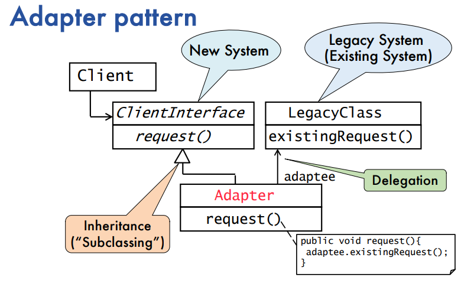
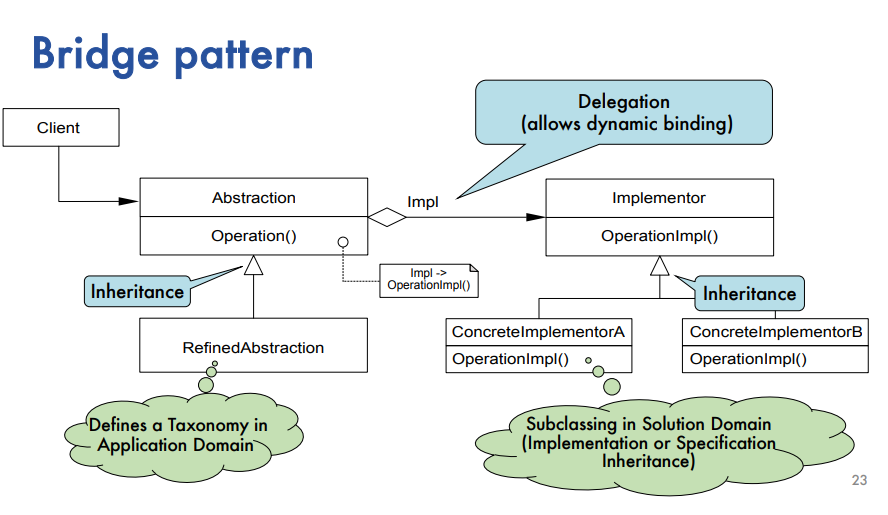
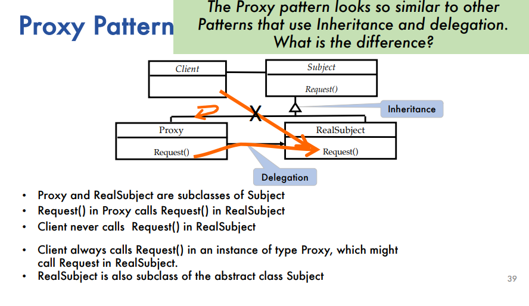
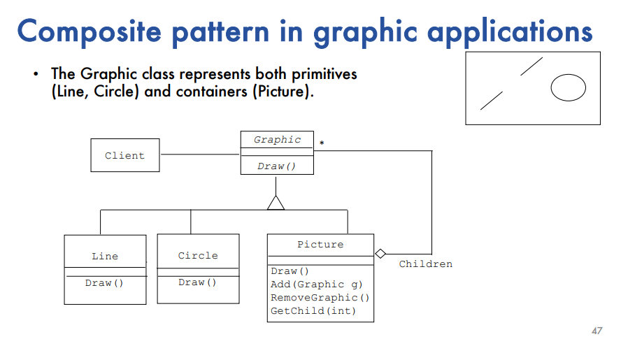

# EMSE: Software Patterns
## Lecture 01: Introduction
### Motivation
domain-specific language: terminology/language used in a specific domain (Chess)

Pattern: useful knowledge piece, help to build complex software in the context of frequent change by **reducing complexity** and **isolating change**	
not just design, but other subjects have patterns too

### SE is more than just coding	
- Problem solving activity (understand, propose solution, engineer based on solution using good design)		
- dealing with complexity (abstractions, models, distribution of tasks)		
- dealing with change (requirements, design, impl, testing, deployment, maintenance)

### Patterns: definition and vocabulary
SE knowledge: algorithms + patterns
algorithm: describable in code, list of steps for desired output/solving a problem ("recipe")

pattern: describing generic solutions to recurring problems in certain contexts

- usually natural languge
- usually with text and pictures (UML, Drawings..)
- describes core of solution in a reusable way without doing it in the same way twice (when implementing)
- typically described with a clear name, problem statement, context, structure, dynamics, examples, ...

Pattern language: vocab for understanding ideas behind patters

- rules to combine collection of patterns into architecture

Pattern catalog: collection of related patterns

- typically subdivides patterns into categories, may include referencing between patterns

### SE knowledge
#### first insight: science can help create knowledge
generally via **empirical methods**  
grounded theory: systematic method to generate theory from data
Qualitative  
- can be used to identify patterns

#### second insight: knowledge is falsifiable
- there is no absolute truth when trying to understand reality
- one can only build theories which are true until somebody finds a counter example
- -> falsification: act of disproving a theory/hypothesis
- "based on this data, by out best judgment, using SotA-knowledge"

#### third insight: _Failures are helpful!_
- analogy: building bridges, a collapse of a bridge leads to stronger bridges
- _"Success in engineering is defined by its failures"_
- failures yield more information than successes because failures draw more scrutiny, a world without failure is a world of complacency

## Lecture 02: Design Patterns: Structural Patterns
### Taxonomy of Design patterns
#### Idiom (Coding Pattern):
- low-level pattern specific to language
- describes how to implement specific aspects of components or relationships between components using features of language

#### Design Pattern:
- Provides scheme for refining subsystems of a software system or the relationship between systems
- Describe commonly recurring structure of communicationg components that solves a general design problem within a context

#### Architectural Pattern:
- Expresses fundamental structural organization of schema for software systems
- Provides set of predefined subsystems and specifies their responsibilities
- Includes rules and guidelines for organizing relationships between subsystems

### What makes design patterns useful?
- generalizations of detailed design knowledge from existing systems
- provide shared vocabulary to designer
- provide examples of reusable designs (inheritance, subclassing, delegation/aggregation)

### 3 Types of design patterns ("go4 patterns")
#### Structural Patterns: 
- Reduce coupling between 2 or more classes
- Introduce abstract class to enable future extensions
- Encapsulate complex structures

#### Behavioral Patterns:
- allow choice between algorithms and assignment of responsibilities to objects (who does what)
- Simplify complex control flows that are difficult to follow at runtime

#### Creational Patterns: 
- Allow a simplified view from complex instantiation processes
- Make system independent from the way its objects are created, composed and represented

### Adapter Pattern:
- Main use: provide access to legacy system
- Why might legacy systems still be in use?
- - cost for new system is too high
- - pragmatism: it works
- - Poor engineering: source code lost, compiler no longer available
- - Availability: cannot simply be taken out of service to be replaced
- **Context**: There are multiple existing systems that we need to connect together
- **Problem**: **Re-writing these systems is not an option** (legacy/cost reasons) and we want to avoid temporary/connector code inside our existing code base
- **Solution**: Create an adapter that connects systems together, Using inheritance to seamlessly replace an interface and delegate within the subclass to access the other system
 

### Bridge Pattern:
- **Context**: We are designing our system to interface with multiple options available (at designtime)
- **Problem**: We don't know how many future options there will be, but they should be able to be added. We want to avoid using multiple IF statements through our implementation which is hard to maintain
- **Solution**: Create multiple usable implementations connected via an implementation bridge. Use delegation to invoke the function, which calls a class with multiple sub-classes (inheritance), each of which is an implementation

- Using a bridge pattern during testing:
- - using Stubs that inherit from implementor class

### Adapter vs Bridge

- Similarity: both hide the details of underlying impl
- Adapter pattern aims at making unrelated components work together
- - Systems are already designed
- - Inheritance followed by delegation
- Bridge is used up-front in a design to let abstractions and implementations vary independently
- - engineering of an extensible system
- - new beasts can be added to the zoo
- - Delegation followed by inheritance

### Proxy Pattern:
- **Context**: We have multiple places where objects share similarities (identical or certain traits)
- **Problem**: These objects may be large, already on the system, unavailable or protected in some way
- **Solution**: Separate the information that should be protected in some way and put it behind a proxy object that loads the basic information first. Use inheritance to define the interchangeable proxy and real implementations, where the proxy delegates to the real implementation when appropriate
- In OOP, Object creation and initialization is particularly costly
- Scenarios where a proxy is appropriate:
- - Caching: proxy object is a local representative for an object in a different address space. Good if information does not change often. Cache flushing required
- - Substitute: Object is expensive, proxy as a stand-in, good for information that is not immediately accessed and good for objects that are not visible (far away)
- - Access Control: proxy object provides access control, good when viewing rights to object must be managed (grade info admin student teacher etc)

### Composite Pattern:
- **Context**: We have similar nested objects that form a tree hierarchy
- **Problem**: The nesting is recursive (containing similar objects), and we don't want to duplicate code when defining these structures + we don't know how deep the nesting goes
- **Solution**: Allow the explicit nesting of objects via a recursive definition. Use inheritance to outline all possible objects that can be used in a similar way, and an extra sub-class that explicity contains children of the superclass

## L03: Design Patterns: Behavioral and Creational Patterns